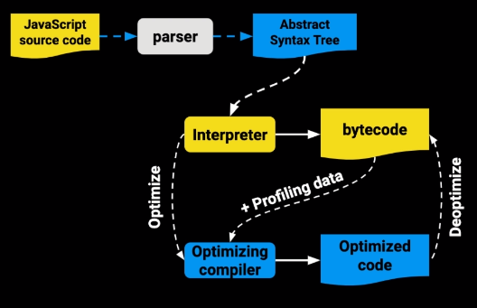

#	BÁSICO
##CONSEJO
Para JavaScript JS se recomienda Chrome, ya que es más compatible con JS. En la <u>*Herramienta de Desarrollador->Consola*</u> se puede ejecutar código JS.
## CONCATENAR
Para concatenar en JS se hace uso de símbolo `+` y también dentro de las comillas invertidas \` \` puedes usar el signo de dólar con llaves \``${…}`\`. Un ejemplo mas claro esta en el apartado de CONSOLE
## CONSOLE
Para enviar código a la consola está el objeto console con el método log para hacer uso de él se escribe lo siguiente `console.log(`**`<string|object|variable|function>`**`)`, vamos a demostrar su uso. Vamos a la consola de Chrome y escribimos lo siguiente:

~~~javascript
console.log('La división de 6 entre 2 es: ' + 6 / 2)
// La división de 6 entre 2 es: 3
~~~
Como pueden observar dentro de los paréntesis se introduce el string (*Cadena de caracteres*), aunque la operación está afuera de las comillas no significa que no hacen parte del string. Lo que sucede es lo siguiente. La operación 6 dividido 2 da el resultado 3 y este se concatena (*Mezcla*) con el string por medio de operador + que en este caso tiene rol de concatenado. Al final de todo el string es “La división de 6 entre 2 es: 3” y se envía a la consola.

~~~javascript
console.log(`La división de 6 entre 2 es: ${6/2}`)
// La división de 6 entre 2 es: 3
~~~
En JS existe otra manera de concatenar código dentro de un string, dentro de las comillas invertidas \`...\` puedes usar el signo de dólar con llaves `${`**`<string|object|variable|function>`**`}`. 
## VARIABLES
En JS se declaran las variables con el prefijo `var`, `let` y `const`. Seguido del nombre de la variable que tienes que comenzar con una letra **`(A-Z, a-z)`**, guion al pizo **`_`** o signo de dólar **`$`**.

Haremos el mismo ejemplo, pero agregando las variables.
~~~javascript
var num1 = 6
var num2 = 2
console.log(`La división de ${num1} entre ${num2} es: ${num1/num2}`)
// La división de 6 entre 2 es: 3
~~~

## FUNCIONES
Ahora vamos a agregar una función, para declarar una función se hace uso de la palabra reservada `function` opcionalmente sigue el nombre de la función para poder hacer llamada la función o si se deja sin el nombre es una ***función anónima*** que no puede ser llamada/invocada. Después se abren los paréntesis donde se nombra los argumentos.
La palabra reservada `return` es lo que devuelve a la hora de llamar la función. Vamos a verlo en acción.

~~~javascript
var num1 = 6
var num2 = 2
function division(numero1, numero2){
	return numero1/numero2
}
console.log(`La división de ${num1} entre ${num2} es: ${divicion(num1,num2)}`)
// La división de 6 entre 2 es: 3
~~~
Las funciones también pueden ser declaradas como una variable. Se aprovecha de que la función no cambia y se usar el prefijo const.
~~~javascript
const division = function (numero1, numero2){
	return numero1/numero2
}
~~~

## ARROW FUNCTION
Es otra manera de declarar funciones en JS.
~~~javascript
//Quitamos la palabra function y ponemos la fecha después de los argumentos
const division = (numero1, numero2) => {
	return numero1/numero2
}
//Como lo que retornamos es la operación podemos olvidarnos del return y las llaves {}
const multiplica = (numero1, numero2) => numero1*numero2;
//Si no hubiera argumentos tenemos que poner los paréntesis
const helloWorld = () => 'Hello World!';
//Si es un solo argumentos podemos dejarlos sin paréntesis
const redondear = numero1 => Math.round(numero1);
~~~

Como puede ver hay dos instrucciones, en la primera se abre llaves por el motivo que hay más de una línea de código. Por eso se encierra entre llaves y se pone return. El otro ejemplo de una línea es porque es solo una instrucción y no es necesario la palabra reservada return ya que por defecto devuelve el resultado.

 **NOTA:** *Las arrow function interpredndan this del scope superior en la mayoria de los casos el objeto **window***
## COMPARACIONES
~~~javascript
var x = 4, y = "7"
x == y // true
x === y // false
~~~
## CONDICIONALES
Es como en la mayoría de los lenguajes de programación.
### IF, ELSE IF Y ELSE
~~~javascript
if (condition) {
	// code
}else if(condition){
	// code
}else{
	// code
}
~~~
### SWITCH
~~~javascript
switch(){
	case 1:
		//code
		break
	case 2:
	case 3:
		//code
		break
	default:
		// code
		break
}
~~~

### SHORT TAG
Manera corta de hacer un if:
En condición si es verdadero, ejecuta la línea ahora como true en caso contrario ejecuta false.
~~~javascript
condición ? true : false;
~~~
## BUCLES 
### FOR
Es como en la mayoría de los lenguajes de programación.
~~~javascript
for (let index = 0; index < array.length; index++) {
	const element = array[index];
	// code
}
~~~
### WHILE
Es como en la mayoría de los lenguajes de programación.
~~~javascript
while (condition) {
	// code
}
~~~
### DO WHILE
Es como en la mayoría de los lenguajes de programación.
~~~javascript
do{
	// code
}while (condition)
~~~

# SCOPE
Es la duración de una variable a las que se puede acceder dentro de cierto bloque de código dependiendo donde y como ha sido declarada. Las variables globales son definidas en el objeto `window.nombreVariable`
## VAR
Cuando declaramos una variable con var, JS lo que hace es hoisting (Elevación), ya que var funciona con ámbito de función. Veamos unos ejemplos:
~~~javascript
function counter(){
	// Como declaramos la variable con var, el escoge el scope superior. 
	// Como si fuera sido declarado acá.
	// var i = 0
	for(var i = 0; i < 10; i++){
		console.log(i) // Hace el conteo desde 0 hasta 9
	}
	console.log(i) // Acá imprime el número 10
}
console.log(i) // Error porque la variable no a sido declarada
~~~

## LET
Cuando declaramos una variable con let, JS lo declara en ámbito de bloque y al momento que el bloque de código donde fue declarado termine. Esa variable ya no será accesible. Veamos un ejemplo:
~~~javascript
function counter(){
	for(let i = 0; i < 10; i++){
		console.log(i) // Hace el conteo desde 0 hasta 9
	}//al finalizar este scope se libra el espacio de esa variable
	console.log(i) // Error porque la variable no a sido declarada
}
console.log(i) // Error porque la variable no a sido declarada
~~~
## CONST
Es lo mismo que let, pero con la diferencia que no puede volver a ser reasignada (No puede cambiar su valor).

# OBJETOS
Para declarar un objeto se hace uso de las llaves `{` `}` un estándar que no es obligatorio pero hace mas fácil es escribir todos los objetos Con la primera letra en mayúscula. Vamos a mostrar un ejemplo de un objeto en JS:
~~~javascript
var carlos = {
	nombre: 'Carlos',
	apellido: 'Garrido',
	edad: 38
}
~~~
Enviar un objeto como parametro en una función es igual que mandarlo como referencia (Quiere decir que el objeto se modifica).
~~~javascript
function nombreEnMayuscula(persona){
	persona.edad += 1
}
console.log(persona.edad) // Edad es igual a 39
~~~

~~~javascript
function nombreEnMayuscula(persona){
	return {
		...persona // copia el objeto
		edad: persona.edad += 1 // Pisa el atributo edad.
	}// Esto devuelve un objeto nuevo con el dato modificado.
}
console.log(nombreEnMayuscula(persona)) // El objeto persona, pero con edad = 39
console.log(persona.edad) // Edad es igual a 38
~~~
## OBJETOS PROTOTIPOS
En JS no existen las clases como tal, vamos a ver la base de OOP de JS.
Es importante entender que antes ECMA 2015 no exitian las clases y por ese motivo vamos a profundisar en el ya que las clases en JS no son como en los otros lenguajes ya que no existía la herencia.

**Ejemplo**
~~~javascript
function Punto(x, y){
// Este seria el constructor del objeto
	this.x = x
	this.y = y
}
// Los métodos/prototipos de el objeto Punto
Punto.prototype.moverEnX = function moverEnX(x){
	this.x += x
}
Punto.prototype.moverEnY = function moverEnY(y){
	this.y += y
}
Punto.prototype.distancia = function distancia(p){
	const x = this.x - p.x
	const y = this.y - p.y

	return Math.sqrt(x*x + y*y)
}

// Creamos el objetos y lo asignamos a una variable
// Es muy importante poner la palabra new sino llamara a Punto como un función
const p1 = new Punto(0, 4)
const p2 = new Punto(3, 0)

// Llama el método distancia y como atributo el objeto p1
console.log(p2.distancia(p1)) 
// Llama el método moverEnX y como atributo 10
p1.moverEnX(10)
console.log(p1.distancia(p2))
~~~
La **herencia** se hacia por medio de una función auxiliar
~~~javascript
function herenciaDe(prototipoHijo, prototipoPadre){
	var fn = function () {}
	fn.prototype = prototipoPadre.prototype
	prototipoHijo.prototype = new fn
	prototipoHijo.prototype.contructor = prototipoHijo
}
function PuntoText(){
	this.x = x
	this.y = y
}
herenciaDe(PuntoText, Punto)
PuntoText.prototype.moverEnX = function moverEnX(x){
	this.x += x
	return `El punto se ha movido ${x}, ahora esta en ${this.x}`
}

const p1t = new PuntoText(3,6)
const p1 = new Punto(3,6)
const p1.moverEnX(4)  // Mueve el punto
const p1t.moverEnX(4) // Mueve el punto y devuelve el string
~~~
## "Clases"
**ECMAScript 2015** introdujo las `"clases"` a JS. En el fondo siguen siendo prototipos.
~~~javascript
class Punto = {
	constructor(x,y){
		this.x = x
		this.y = y
	},
	moverEnX(x){
		this.x += x
	}
	moverEnY(y){
		this.y += y
	}
	distancia(p){
		const x = this.x - p.x
		const y = this.y - p.y

		return Math.sqrt(x*x + y*y)
	}
}
class PuntoText extends Punto {
	constructor(x,y){
		super(x,y) // Cuando es una clase hijo debe enviar los atributos que exige su padre.
	},
	moverEnX(x){
		this.x += x
		return `El punto se ha movido ${x}, ahora esta en ${this.x}`
	}
}

//Creamos el objetos y lo asignamos a una variable
const p1 = new Punto(0, 4)
const p2 = new Punto(0, 4)
const p2t = new PuntoText(0, 4)

// Llama el método distancia y como atributo el objeto p1
console.log(p2.distancia(p1)) 
// Llama el método moverEnX y como atributo 10
p1.moverEnX(10) // Mueve el punto
p2t.moverEnX(10) // Mueve el punto y devuelve el string
console.log(p1.distancia(p2))
~~~

### CONSTRUCTOR
El constructor de un objeto es una función, lo que lo hace un objeto es la palabra reservada `new` a la hora de declararse, seguido del nombre del objeto *(Función ‘Constructor’)* cuando no se usa class y cuando se usa una clase por defecto se llama a la función constructor.
### PARÁMETROS
Para declarar los parámetros se usa la palabra/objeto reservado `this` como se puede observar en el código de arriba.
### METODOS
Para declarar un método se usa el nombre del constructor seguido de la palabra reservada prototype y le sigue el nombre del método de la siguiente manera `objecto.prototype.nombreMetodo`. En el ejemplo con las `"clases"` con solo meterno en el cuerpo de la clase.
### __PROTO__
Esto es equivalente a el método `prototype`, todos los objetos tienes este método donde están todos los punteros de sus métodos. Por lo tanto, si se hace un cambio a un método, todos los objetos son afectados con ese cambio.
`return this` en JS es ilícito por motivo que al usar la palabra reservaba new JS retorna `this`.

En el ejemplo de arriba muestro otra forma de declarar objetos para JS y también tenemos las clases de JS que en si no son clases sino objetos, pero con la ayuda de la versión ECMAScript 2015 se cambia la sintaxis. 

## OBJETO DATE()
`new Date()` *Crea un objeto con la fecha y hora actual*
`new Date(YEAR, MONTH, DAY, HOURS, MINUTES, SECONDS, MILLISECONDS)`
`new Date(MILLISECONDS)`
`new Date(DATE STRING)`

# MÉTODOS NATIVOS JS
## STRING
|Método|Descripción|extra|
|------|:----------|:----|
|`toLowerCase()`|Devuelve el string todo en minúsculas|
|`toUpperCase()`|Devuelve el string todo en mayúsculas|
|`endsWith(`**`str`**`)`|Devuelve true cuando el string termina con el string enviado como argumento.|**str:** String que se buscara al final.|
|`strartsWith(`**`str`**`)`|Devuelve true cuando el string comienza con el string enviado como argumento.|**str:** String que se buscara al comienzo.|
|`slice(`**`start`**` [, `**`end`**`])`|Devuelve un string cortado con los indexes enviados como argumento.|**start:** un entero que define la posición en la que va a comenzar a cortar.   **end:** un entero que define la posición en la que termina Números negativos van de derecha a izquierda
|`split(`**`str`**`)`|Devuelve un array con particiones por un delimitador designado que este en el string|**str:** delimitador, si se manda vació va a devolver un array con cada carácter|
|`charAt(`**`index`**`)`|Devuelve el carácter en la posición del index enviado como argumento.|**index:** entero de la posición del carácter deseado.|
|`substr(`**`start`**`)`|
## MATH
|Método|Descripción|extra|
|------|:----------|:----|
|`round(`**`float`**`)`|Redondea hacia el número más cerca.|
|`floor(`**`float`**`)`|Redondea hacia abajo (1.9 = 1)|
|`ceil(`**`float`**`)`|Redondea hacia arriba (1.1 = 2)|
|`random()`|Devuelve un numero al azar del 0 al 1.|
## ARRAY
|Método|Descripción|extra|
|------|:----------|:----|
|`filter(`**`callback`**`)`|Devuelve todo un array que el callback devuelva true.| ver ejemplo abajo|
|`map(`**`callback`**`)`|Pasa una función por el array con el cual retorna otro array.| |
|`reduce(`**`callback`**`[,`**`int`**`])`|Devuelve una acumalacion que se hace con el callback.| **int** Es el numero inicial para el acumulador|
|`reverse()`|Devuelve todo un array en orden contrario.|
|`join()`|Convierte un array en un string concatenando todo su contenido.|
~~~javascript
var personas = [diego, andres, pedro] // todas las variables son objetos.
const esMayor = ({ altura }) => altura > 1.8
personasAltas = personas.filter(esAlto)
console.log(personasAltas) // devuelve todas las personas altas en un array
console.log(personas) // devuelve todas las personas en un array
~~~
## NUMBER
|Método|Descripción|extra|
|------|:----------|:----|
|`toFixed(`**`dec`**`)`|Devuelve un numero flotante con las cifras declarado como argumento para número atrás del punto/coma.| **dec:** número definiendo la cantidad de decimales|
# PROPIEDADES
## STRING
|Propiedades|Descripción|
|-----------|:----------|
|length|Devuelve el número de caracteres de un string|

# JS PROFESIONAL
## Como llega un script al navegador
Por defecto el navegador detiene la ejecución de la la lectura del `DOM` cuando encuentra una etiqueta `script`, descarga tal `script` y lo ejecuta después sigue con la lectura del `script`. la etiqueta `script` tienes dos atributos que son `async` y `defer`.
* `` de esta forma el archivo es llamado pero la ejecución del DOM no es detenida durante la descarga y se detiene cuando ya se ha descargado para ejecutar el código.
* `` de esta forma el archivo es descargado pero no es hasta que la lectura de el DOM termina se ejecuta.

## Module
Este es un scope nuevo, que solo es soportado por exploradores modernos. Para incluir un archivo con module usamos `` teniendo en cuenta que los modules debe cumplir con una estructura de `export` e `import`.

## Closure
Son funciones que retornan funciones y estas funciones pueden tener valores predefinidos donde no podemos modificar ya sea por que era variables que esta en la función padre o pasadas como parámetro.

~~~javascript
function makeCounter(n) {
  let count = n
  return {
    increase: function() {
      return ++count
    },
    decrease: function() {
      return --count
    },
    getCount: function() {
      return count;
    },
  }
}

let counter = makeCounter(10);
counter.decrease();
counter.increase();
counter.count = 2; // esto da un error ya que esa variable no es accesible desde afuero solo puede ser manipulada con los funciones pre definidas increase, decrease, getCount;
~~~

## this
El JS hay unos momentos donde `this` puede ser otra referencia que no es el objeto en si.

~~~javascript
// this en el scope global
// `this` es window el objeto principal de un navegador, aunque dentro de node es module.
console.log(`this: ${this}`);

// this en el scope de una función
// this también hace referencia a el objeto window a menos que estemos usado JS en modo estricto seria undefined.
function whoIsThis() {
  returnthis;
}
console.log(`whoIsThis(): ${whoIsThis()}`);
// this en el scope de una función en strict mode
'use strict';
function whoIsThisStrict() {
  'use strict';
  returnthis;
}
console.log(`whoIsThisStrict(): ${whoIsThisStrict()}`);

// this en el contexto de un objeto
// this hace referencia a si mismo hasta dentro de una función.
const person = {
  name: 'Frank',
  saludar: function () {
    console.log(`Hola soy ${this.name}`);
  }
}

console.log(`person.saludar: ${person.saludar()}`)

// this cuando sacamos a una función de un objeto
// this hace referencia a el objeto windows/module.
const accion = person.saludar;
accion();

// this en el contexto de una "clase"
function Person (name) {
  //this comienza siendo {}
  this.name = name;
}

Person.prototype.saludar = function() {
  console.log(`Me llamo: ${this.name}`);
}

const juanda = new Person('Juanda');
juanda.saludar();
~~~

## Cambiar contexto de this (call, apply, bind)
call, apply, bind son funciones que viene en el prototype de todas las funciones.

~~~javascript
 // Establece `this` usando `call`
  //aqui establecimos el valor de this para la funcion saludar
  functionsaludar () {
    console.log(`Hola soy ${this.name}${this.apellido}`)
  }

  const fran = {
    name: 'Francisco',
    apellido: 'Garcia'
  }

  saludar.call(fran)

  // Establece `this` usando `call` y pasar argumentos a la función
  functioncaminar (metros, direccion) {
    console.log(`${this.name} camina ${metros} metros hacia ${direccion}`)
  }

  caminar.call(fran, 400, 'norte');

  // Establece `this` usando `apply` y pasar argumentos a la función
  //recibe los parametros como un arreglo (array)
  const valores = [1500, 'el noreste'];
  caminar.apply(fran, [800, 'al sur']);
  caminar.apply(fran, valores);

  //diferencia entre call y apply
  //call los argumentos se pasan separados por coma
  //Apply los argumentos se pasan en un Array

  // Establecer `this` en una nueva función usando `bind`
  //se usa para hacer funciones reutilizables
  const juanda = {
    name: 'Juan David',
    apellido: 'Garcia'
  }

  const juandaSaluda = saludar.bind(juanda);
  juandaSaluda();

  const juandaCamina = caminar.bind(juanda);
  juandaCamina(3576, 'al sur oriente');

  const juandaCamina2 = caminar.bind(juanda, 1234, 'al oriente');
  juandaCamina2();

  //de esta forma guardamos parcialmente los argumentos y luego llenamos los demas

  const juandaCamina3 = caminar.bind(juanda, 5566);
  juandaCamina3('el infinito y mas alla');

  // Cuándo es útil usar uno de estos métodos
  // call y apply asignan el valor de this y se va a ejecutar inmediatamente
  // bind crea una nueva funcion,
  
  //const buttons = document.getElementsByClassName('call-to-action');
  const buttons = document.getElementsByClassName('call-to-action');
  // buttons.forEach(button => {
  //   button.onClick = () => alert('Nunca pares de aprender!!!')
  // });

  // Array.prototype.forEach.call(buttons, button => {
  //   button.onClick = () => alert('Nunca para de apreder!!!!!')
  // });

  Array.prototype.forEach.call(buttons, button => {
    button.onclick = () => alert('Nunca pares de aprender!!!!!!');
  });

  //Da error por que buttons, es un NodeList y no una funcion
~~~

## Prototype
En JS todo son objetos, vamos a ir creando ejemplos hasta llegar al uso de prototype.

~~~javascript
// esta es la forma mas simple de crear un objeto con una función, pero cada vez que necesitemos uno nuevo lo tenemos que hard codear
const newObj = {
  name: "Yefri"
}

newObj.saludar = function() {
  console.log(`Hola soy ${this.name}`);
}

newObj.saludar(); // Console: Hola soy Yefri
~~~
~~~javascript
// ahora lo vamos hacer dentro de una función para que sea como constructor donde se va retornar un objeto.
function Person(name) {
  const person = {
    name: name
  }

  newObj.saludar = function() {
    console.log(`Hola soy ${this.name}`);
  }
  return person;
}

// pero esto no es muy eficiente por que cada vez creamos un nuevo objeto va crear la función saludar en memoria.
const newObj = Person("Yefri");
newObj.saludar(); // Console: Hola soy Yefri
~~~
~~~javascript
// para evitar eso podíamos aver hecho una variable global para pasarlo como referencia.
const personMethods = {
  saludar: function() {
    console.log(`Hola soy ${this.name}`);
  }
}

function Person(name) {
  const person = {
    name: name
  }

  newObj.saludar = personMethods.saludar;
  return person;
}

const newObj = Person("Yefri");
newObj.saludar(); // Console: Hola soy Yefri
~~~
~~~javascript
// Aunque es muy tedioso si tenemos en cuenta que vamos a tener muchos métodos, pero existe una manera con la cual podemos evitarnos eso y es con Object.create(), esto lo que logra es enviar todos los métodos al prototype
const personMethods = {
  saludar: function() {
    console.log(`Hola soy ${this.name}`);
  }
}

function Person(name) {
  const person = Object.create(personMethods);
  hero.name: name;

  return person;
}

const newObj = Person("Yefri");
newObj.saludar(); // Console: Hola soy Yefri
~~~
~~~javascript
// Bueno mejoremos esto con prototype, ya que es la forma por defecto cuando usamos la palabra reservada new.
function Person(name) {
  const person = Object.create(Person.prototype); // esto cuando usamos la palabra new a la hora de crear el objeto, esto se hace automático. la diferencia estan en que esto se le asigna a this.
  person.name: name;

  return person; // automático con la palabra new
}

Person.prototype.saludar = function() {
  console.log(`Hola soy ${this.name}`);
}

const newObj = Person("Yefri");
newObj.saludar(); // Console: Hola soy Yefri
~~~
~~~javascript
// Veamos el ejemplo con la palabra new, lo que esta comentado dentro de la función pasa implícitamente
function Person(name) {
  // this = Object.create(Person.prototype);
  this.name: name; // aca usamos this ya que es lo que se retorna.

  // return this;
}

Person.prototype.saludar = function() {
  console.log(`Hola soy ${this.name}`);
}

const newObj = new Person("Yefri");
// Como puedes ver la palabra new es mas tanto para facilitar la escritura, pero es algo que ya se podia hacer.
newObj.saludar(); // Console: Hola soy Yefri
~~~

Es bueno tener en cuenta que actualmente en JS existe el la palabra `class`, pero al igual que new es solo facilitacion de escritura, pero son cosas que ya se podian hacer sin.

## Como funciona el motor de JS

### Que hace un parse
Este agarra tu código y lo lee, pero lo que tu escribes no es lo que la computadora entiende, primero lo tiene que descomponer, lo que hace es identificar las palabras claves a estos pedazos de les llama tokens, cuando el parse no puede reconocer una estructura ella envia un `Syntax Error`

### AST
Que es el AST (Abstract Syntax Tree) es una estructura de grafos que representa un programa. A base de los tokens se crea el AST. Con esta estructura es que se encarga JS Engine de comprender el codigo y enviarlo a bytecode. En eset link https://astexplorer.net/ podemos analizar el AST del código

### Bytecode
El bytecode es como un assembler, es un código que se puede escribir pero de muy bajo nivel. Después de obtener el byte este se procesa por el compilador y es optimizado para su ejecución.

### Eventloop
El eventloop trabaja en conjunto con diferentes mecanimos.
* Stack
* Heap
* Schedule Tasks (Web API)
* tasks Queue
* Micro-tasks Queue
#### Stack
El primero que vamos hablar del es el `stack`, esto es una `pila de orden procesos` que se van apilando a base como se vallan llamando. 
a la action de agregar algo a la pila se le llama push y sacar algo de la pila se le llama pop.

#### Memory HEAP
Es un espacio en memoria mucho mas grande donde los datos no tienen un orden. Aca es donde se guarda toda la información de las variables, funciones, scope, etc.

#### Schedule Tasks
Son tareas que se le dan para procesar/ejecutar en asíncrono. Normalmente es el browser se encarga de ejecutar.

#### Task Queue
Despues que las `Schedule Tasks` termina con una tarea la enfila dentro del `Task Queue` para cuando el `Stack` este vacio/disponible. `Eventloop` es el encargado de ver si el `stack` esta vació y enviarlo a ejecutar.

#### Micro-Tasks Queue
Es otra fila que tiene mas prioridad que `Task Queue` las promesas siempre van a esta fila por lo tanto tiene mas prioridad.

## Getters and Setters
Son palabras reservada para hacer un método un parámetro. Veamoslo en un ejemplo.

~~~javascript
const person = {
  nombre: "yefri",
  apellido: "gonzalez",
  get nombreCompleto() { // este nombre de metodo va ser usado como parametro cuando se llama algo se ejecuta
    return `${this.nombre} ${this.apellido}`;
  },
  set nombreCompleto(value) { // este nombre de metodo va ser usado como parametro cuando se asigna algo se ejecuta
    const parts = value.split(" ");
    this.nombre = parts[0];
    this.apellido = parts[1];
  }
}

person.nombreCompleto = "Yefri Gonzalez" // se ejecuta el setter y como parámetro va lo asignado.
console.log(person.nombreCompleto) // se ejecuta el getter
~~~

## Proxies
Son interceptores de un objeto donde puedes poner diferentes trampas para asi hacer un cambio/sniff o lo que te imagines cuando se hace un llamado a un parámetro o método.
https://developer.mozilla.org/en-US/docs/Web/JavaScript/Reference/Global_Objects/Proxy

https://github.com/shama/letswritecode
~~~javascript
const person = {
  first: 'Bear',
  last: 'McBearison'
}

const cleverPerson = new Proxy(person, {
  get: function (target, prop) {
    if (!(prop in target)) {
      return prop.split('_').map(function (part) {
        return target[part]
      }).join(' ')
    }
    return target[prop]
  }
})

console.log(cleverPerson.last_first_first_first_first_first)

cleverPerson.last = 'Beary'
console.log(cleverPerson.first_last)
~~~

## Generators
Son funciones que se les da un paro que después se puede continuar en cualquier momento veamos un ejemplo;

~~~javascript
function* idMaker() {
  var index = 0;
  while(true){
    yield index++; // la ejecución se suspende liberando el hilo de ejecución y regresara en el momento de darle la instrucción de seguir.
  }
}

var gen = idMaker(); // "Generator { }"

console.log(gen.next().value); // 0
console.log(gen.next().value); // 1
console.log(gen.next().value); // 2
~~~

## Rechazar un ajax con fetch
Fetch tiene la siguiente sintaxis `fetch(consult: string, [init: object])` donde dentro de init puedes configurar diferentes cosas como los `headers`, `body`, entre otros, ahi también esta la opción `signal` que se maneja con la clase `AbortController`. veamoslo en código.

~~~javascript
let controller = new AbortController();
fetch(url, {
  signal: controller.signal
})
  .then(res => res.json())
  .then(data => {
    console.log(data);
  })
  .catch()

setTimeout(() => {
  controller.abort()
}, 2000)
~~~

## IntersectionObserver
Es una clase que mantiene el monitoreo de un elemento y saver cuando es interceptado por la pantalla de browser. La sintaxis de la clases es la siguiente `InterceptionObserver(handler, [config])`.
https://developer.mozilla.org/en-US/docs/Web/API/IntersectionObserver

~~~javascript
let el = document.querySelector("#container");
let observer = new IntersectionObserver(observerCallback, {
  threshold: 0.2
});
observer.observe(el)
const observerCallback = (entry) => {
  entry.intersectionRatio // porcentaje del  lo que es visible del elemento que se observa
}
~~~

## VisibleChange
Este evento es para saber cuando esta el usuarios dentro de nuestro tab.

~~~javascript
document.addEventListener('visibilitychange', () => {
  document.visibilityState // estado es 'visible' o 'hidden'
})
~~~

## Services Workers
Son una capa que guarda peticiones en cache.

**index.js**
~~~javascript
if('serviceWorker' in navigator){
  navigator.serviceWorker.register('sw.js').catch(error => {
    console.log(error);
  })
}
~~~

**sw.js**
~~~javascript
const VERSION = "v1";

self.addEventListener('install', event => {
  event.waitUntil(precache());
});

self.addEventListener('fetch', event => {
  const request = event.request;
  // get
  if (request.method !== 'GET') {
    return;
  }

  // buscar en cache
  event.respondWith(cachedResponse(request));

  //Update the cache

  event.waitUntil(updateCache(request));

})

async function precache() {
  const cache = await caches.open(VERSION);
  return cache.addAll([
    '/',
    '/index.html',
    '/assets/index.js'
  ]);
}

async function cachedResponse( request ) {
  const cache = await caches.open(VERSION);
  const response = await cache.match(request);
  return response || fetch(request) ;
}

async function updateCache( request ) {
  const cache = await caches.open(VERSION);
  const responce = await fetch ( request );
  return cache.put(request, responce);
}
~~~

## TypeScript
TypeScript le da la habilidad a javascript de ser fuertemente tipado. eso significa que las variables no pueden cambiar de tipo.
### Types
~~~typescript
// Boolean
let muted: boolean;
muted = false;
muted = "true"; // aca va a dar un error, ya que no cumple con el tipo

// Number
let age = '6';
let numerador: number = 42;
let age = 6; // dara error ya que age es un string
let denominador: number = age: // Aca saltara un error, ya que age es un string
let decimal: number = 6;
let hex: number = 0xf00d;
let binary: number = 0b1010;
let octal: number = 0o744;

// String
let fullName: string = `Bob Bobbington`;
let age: number = 37;
let sentence: string = `Hello, my name is ${ fullName }.
I'll be ${ age + 1 } years old next month.`;

// Array
let list: number[] = [1, 2, 3];
let list: Array<number | string> = [1, 2, '3rd'];

// Declare a tuple type
let x: [string, number];
// Initialize it
x = ["hello", 10]; // OK
// Initialize it incorrectly
x = [10, "hello"]; // Error

enum Color {Red, Green, Blue}
enum Color2 {Red = "Red", Green = "Green", Blue = "Blue"}
let c: Color = Color.Green; // esto retorna un numero 1, por que es el index del color.
let c: Color2 = Color2.Green; // esto retorna un string con el nombre del color

// Any
let notSure: any = 4;
notSure = "maybe a string instead";
notSure = false; // okay, definitely a boolean

// Object
let obj = {};
let obj2: object; 
~~~
### Funciones
~~~typescript
// funcion
function add(a: number, b: number): number {
  return a + b;
}

const sum = add(4, 6);
const sum = add(4, "6"); // Error need to be a string

// closure
functio createAdder(a: number): (number) => number {
  return function(b: number) {
    return b +a;
  }
}

const addFour = createAdder(4);
const fourPlus6 = addFour(6);

// valores opcionales/predefinidos
//en este caso lastName es opcional
function fullName(fisrtName: string, lastName?: string): string { 
  return `${firstName} ${lastName}`;
}
//en este caso lastName es opcional
function fullName(fisrtName: string, lastName: string = "Pedro"): string { 
  return `${firstName} ${lastName}`;
}
~~~

### Interfaces